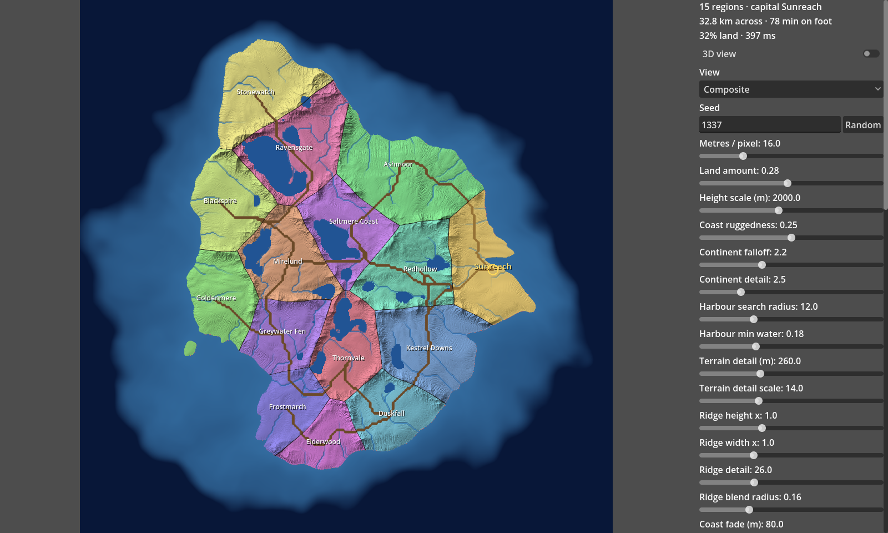

# Godot TerraForge

GPU world generator for baking RPG heightmaps. Godot 4.7, compute shaders. An editor plugin, not a game.

Tweak sliders, watch the map update, then export a bake your game can load.



## Install

Needs [Godot 4.7](https://godotengine.org/download) — the standard build, no extra dependencies.

It is an editor plugin. Copy `addons/terraforge/` into your own project's `addons/` folder, then
enable **TerraForge** under *Project → Project Settings → Plugins*. A **TerraForge** tab appears
next to 2D / 3D / Script.

```
git clone https://github.com/nth-alex/godot-terraforge.git
cp -r godot-terraforge/addons/terraforge your-project/addons/
```

Self-contained: one folder, no dependencies, no autoloads, and no global class names — nothing in
your project can collide with it. The flythrough camera ships inside it.

Cloning this repo on its own also works — open the folder in Godot and the plugin is already
enabled. It still runs standalone if you prefer a separate window:

```
/Applications/Godot.app/Contents/MacOS/Godot --path .
```

Windowed only — compute shaders need a RenderingDevice, so `--headless` will not work.

Self-check (generates, asserts, writes screenshots, quits):

```
/Applications/Godot.app/Contents/MacOS/Godot --path . -- --test
```

## What it generates

Pipeline runs continent → harbour → regions → ridges → basin → erosion → water → roads → composite.
Each stage writes its own texture; the last one is the bake.

- Continent shape with warped coastline and a sheltered harbour site
- Mountain ridges with passes, inland basin, coastal shelf
- Droplet erosion, depression fill, flow accumulation, rivers and lakes
- Least-cost roads between region capitals
- Voronoi regions with relaxation and warped borders

Views: biome composite, raw height, regions, water. 3D flythrough preview included — click the view to fly, Esc gives the mouse back.

## Export

"Export bake" writes to `res://export/` in whichever project the plugin is installed in:

| File | Contents |
| --- | --- |
| `heightmap.exr` | Height in real metres (32-bit float). Falls back to 16-bit `heightmap.png` if EXR is unavailable. |
| `regions.png` | Region id per pixel, `255` = ocean |
| `water.png` | R = river strength, G = lake depth in metres |
| `roads.png` | Road strength |
| `preview.png` | Rendered composite |
| `world.json` | Scale, sea level, seed, region list, road graph, layer legend |

Heights are metres above zero, not normalised — `world.json` carries `sea_level_m` and `height_scale_m` so importers do not have to guess.

## Settings

Every slider has a tooltip explaining what it does and which way to push it. Same seed plus same settings always gives the same world.

Region names and palettes live in `addons/terraforge/regions.json`.

## Notes

Run `Godot --path . --import` after editing any `.glsl`, or the old SPIR-V is used silently.

Compute runs on its own local `RenderingDevice`, so generating inside the editor does not touch
the editor's renderer.

## Licence

MIT
